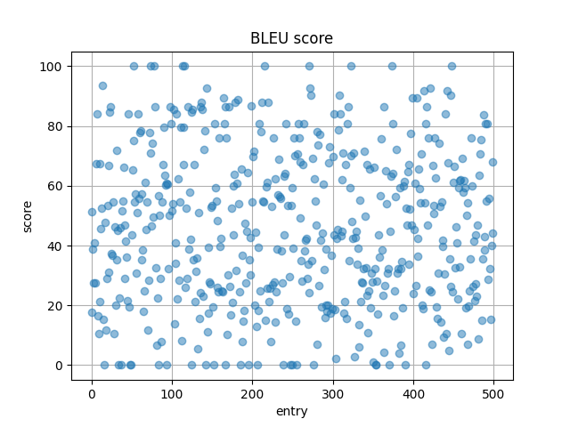
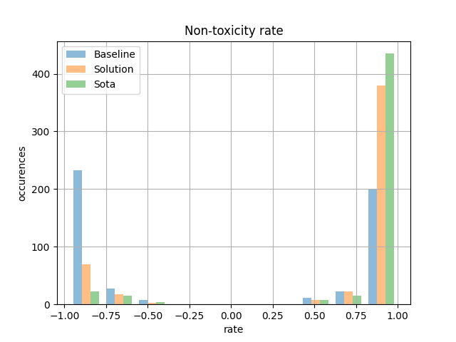
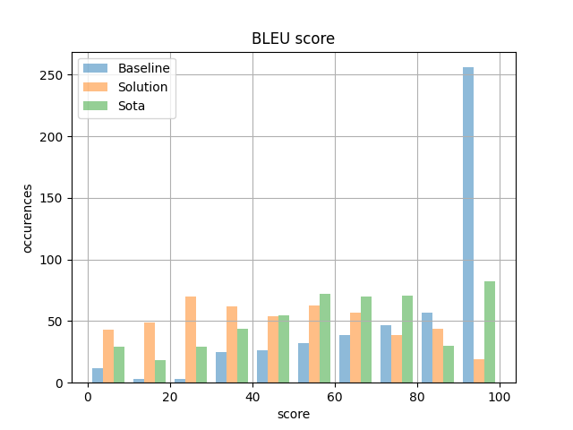

# Final solution

## Introduction

I would say that in comparison to my baseline solution, the final one looks quite boring.
It is so, because on the lab we were introduced with example of T5 model being fine-tuned to translate from English to German.

I have found the approach of translation very similar to what we need to do in this task.

## Data analysis

We are working with filtered ParaNMT-detox corpus from [here](https://github.com/skoltech-nlp/detox/releases/download/emnlp2021/filtered_paranmt.zip) and it is not the best raw data possible. The filtering of the data is not good because there are entries that after translation appeared to be with highed toxicity than before.

That is why I have filtered the dataset so that it contains only entries where toxicity level was above `0.9` before translation and lower than `0.1` after.

## Model specifications

As I have mentioned for the final solution I have used T5-small model and fine-tuned it. The original model can be found [here](https://huggingface.co/t5-small). "T5-Small is the checkpoint with 60 million parameters."

## Training process:

For the training I have used 5000 entries from `train` part of dataset and 500 entries from `val` part.

The training process is done in [this notebook](../notebooks/4_0_t5_model.ipynb).

Running for the 10 epochs only with such small subset of dataset was enough for the model to perform well in the text detoxification task.

## Evaluation:

I have put much effort into baseline solution and decided to apply the same procedure in [this notebook](../notebooks/4.1-t5-evaluation.ipynb):

1. I have formulated a fixed 500 entries dataset for evaluation which is not seen during training process.
2. Then, compute `non-toxicity` metric using [model](https://huggingface.co/mohsenfayyaz/toxicity-classifier?text=Motherfucker) from HuggingFace.
3. Lastly, compute BLEU score to compare the results in terms of quality of translation.

Results for my final model were the following:

Corresponding histograms for these data:

Moreover, I have experimented with attention visualization using [bertviz](https://github.com/jessevig/bertviz) library. You can see the results I have visualized in [this notebook](../notebooks/4.2-t5-visualization.ipynb)

## Results:

In this section I would like to discuss the [results of comparison](../notebooks/6.0-overall-comparison.ipynb) of all approaches:

Non-toxicity histogram shows us how `non-toxic` were the results of translation of original sentences. We can observe that SOTA model and my final solution are comparably good at this task, while the baseline resulted in about 50% non-toxic sentences.

It is interesting that even on 5000 entries the T5-small model was able to achieve such results in non-toxicity. That proves that this model is applicable for most of the NLP text-to-text tasks as author state.

Looking at the BLEU metric suggests that the baseline is the best in terms of it, but it is because of the approach used. Regarding task detoxification this metric can only guide us whether some sentences are completely different or not. The SOTA model and my final solution have comparably same score, which suggests they produced pretty much the same results.

