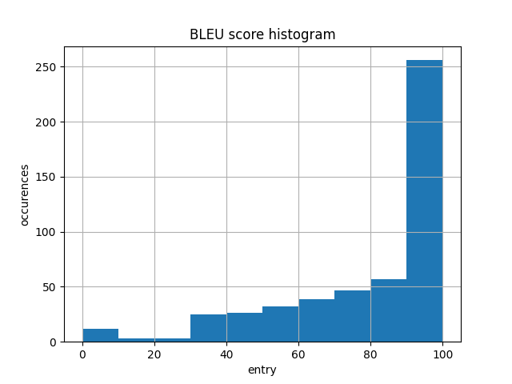

# Solution building

This report is sort of introduction into how I have built my solution for the problem of text detoxification. I will divide it into the following subsections:

## Contents

1. [Baseline idea](#baseline-idea)
2. [SOTA](#sota)

## Baseline idea

After first look into the problem my idea was to mask `bad` words and feed it to BERT model. Then, substitute them into original sentence and done.

This idea is explored in the [notebook](../notebooks/1.0-bert-idea-exploration.ipynb).

First problem I have encountered is that it is difficult for BERT to preserve the context of the sentence when substituting the new word. For this purpose I have used library called `spacy` which compares toxic word with its possible substitutes from BERT and choses the one which is the most similar to the original word. You can see examples of `spacy` usage and BLEU metric in [this notebook](../notebooks/1.1-metrics-exploration.ipynb).

I have thought about further evaluation of toxicity I aim to reduce and found [this model](https://huggingface.co/mohsenfayyaz/toxicity-classifier?text=Motherfucker) in Hugging Face platform. Given the sequence it produces rating of toxicity. It will be used for further evaluation.

### Cons of this approach:

#### Dictionary-dependent:

There is a need to somehow detect toxic words for substitution. My approach was investigated in [notebook 1](../notebooks/2.0-bad-words-vocab.ipynb) and [notebook 2](../notebooks/2.1-toxic-words-filtering.ipynb) where I create such toxic vocabulary.

The process was the following:

1. Split the original dataset into two parts: `train` and `evaluation`.
2. Vocabulary should be created only from `train` subset in order to be fair.
3. Find set difference between words in translated sentence and original one.
4. Stem the words using `nltk` to filter out the same words with different endings.

As expected it lead to several problems:

1. The quality of vocabulary: there are normal words which appear from paraphrasing and they are not toxic.
2. The original dataset is quite noisy, meaning there are some entries where the toxicity even increased significantly after translation. To solve this issue I address only the subset of given data where toxicity level was above `0.9` before translation and lower than `0.1` after.
3. The size of vocabulary: even if I would add up some external dictionaries it is not possible to cover all toxic words from English. Therefore, this will be always the limitation for this approach.

#### Hard to embed:

The solution I have came up with is highly embeddable. For instance, it requires you to contain dictionaries for similarity, for toxicity, the model itself. The whole setup for the evaluation might be quite difficult to reproduce.

### Pros of this approach:

#### Straightforward:

The idea is very simple, it is easy to understand and implement.

## Baseline evaluation

In order to evaluate BERT I have formulated a fixed 500 entries dataset. Such low number of entries is due to computational limitations, while it is enough to get the performance outline.

The evaluation is done in [this notebook](../notebooks/3.0-evaluate-bert.ipynb). During evaluation process I save non-toxicity rate and BLEU metric.

The results were the following:

But it is rather easier to interpret the results in the histogram view:

### Analysis:

Non-toxicity rate suggests that almost half of the entries were not transformed enough to remove toxicity. The cons I have described above are the main reasons for this.

BLEU metric shows high score because this approach replaces words in-place and does not change the structure of the sentence. Therefore, it is easy to get high BLEU score.

## What could be done in another way in baseline?

- After I got those results I have thought that if we might use some model for toxicity evaluation, we can just brute-force toxic words from the sentence. This way we can replace almost all of them just in order to result in low toxicity.

But I believe more efforts into the development of this solution will not result in better meaning preservation and will not be able to complete with the SOTA.

## SOTA

While I will discuss my final solution in the next report, I have to mention what is the SOTA and the target to compete.

The research group of Skoltech published their paper on [Text detoxification](../references/2021.emnlp-main.629.pdf) and we were asked to perform the task on the dataset from their paper. However, the year later they presented another work called [ParaDetox: Detoxification with Parallel Data](../references/2022.acl-long.469.pdf) where they introduce the model [bart-base-detox](https://huggingface.co/s-nlp/bart-base-detox).

The crucial change between those papers is the dataset because it was manually edited and filtered. Additionally, more complex training process was used.

Although I might have used different dataset for testing my own final solution, I decided to evaluate their SOTA model on the same dataset I have for this assignment.

The process of their work is described [here](https://github.com/s-nlp/paradetox).
